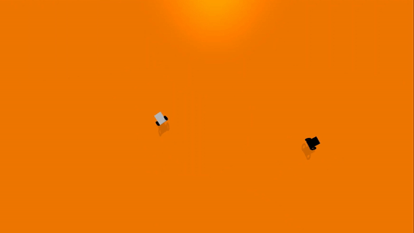
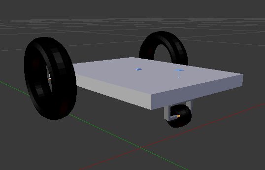

# Adversarial Chase and Run Cars Gym

Adversarial Chase and Run Cars Gym is a **gym environment**, to test and develop algorithms related to **Multi Agent Systems**, especially those related to Multi-Agent Reinforcement Learning. This was done under the Robotics Research Group (RoboReG) to try and learn emergent behavior between agents competing against each other via Reinforcement learning and how it could generate new control strategies.

This gym environment consists of **2 mobile robots**, where the task of one of the robots is to chase the other one, while the other simply avoids the chaser. The environment also consists of **walls which define the operating area**, so that the robots remain confined in a particular area. Though this has been done in 2D-worlds, **analyzing emergent behaviour** in a physical world with **real physics and dynamics** is a relatively less explored area.

   

The gym environment was built in the physics simulator **[PyBullet](https://pybullet.org/) - a python module for physics simulations of robots**, because of its easy usage and integration with RL frameworks like **Stable Baselines**. Work is currently being done on training the agents to compete via Multi Agent Reinforcement Learning.

The **mobile robots** that are being used in the environment were built and designed completely in **Blender**, and were exported as **URDFs**, so that they could be imported in all physics simulators.

## Objective

One of the key challenges and active areas of research in **robotics and control systems** are **multi-agent systems**, especially those which involve collaboration or competition between individual systems. The **traditional control strategies** in these situations require a lot of control equations with **underlying mathematics** and **physical dynamics** of the system along with the communication protocols. This however, confines these systems to work in an already known fashion without display of any new behaviour. Through this project, we aim to visualize **new emergent behaviours** in competitive as well as mixed settings (competitive + collaborative) using **multi-agent reinforcement learning** as they provide a more robust and efficient way of developing a control system with the ability to perform new behaviours than traditional methods.

## Installation Guidelines

This gym environment can be installed by following these steps:

0. Although not compulsory, we strongly recommend creating a virtual environment specific to this project. This will help in package management and for decluttering your workspace. A simple way to create a virtual environment is as follows:

   ~~~bash
   python3 -m venv <Env_Name>
   ~~~

   Activation and deactivation of the virtual environment, will be done as specified [here](https://docs.python.org/3/library/venv.html). Scroll down to the table where the activation method for various operating systems is provided. Deactivation, in most cases, can be done by simply typing deactivate while being in in the virtual environment.

1. Once you activate your virtual environment, you will have to install the various dependencies of this project. We have simplified this process for you. Just follow the following steps:
   * Download/Clone this repository on to your local machine.
   * Navigate to the root folder of this repository through your terminal.
   * Execute the following command in your terminal.

      ~~~bash
      pip install -e adversarial-gym
      ~~~
   * Now, the environment can be created by calling this function in the python file:
      ~~~
      env = gym.make("adversarial_cars-v0")
      ~~~

In case there are problems with the PyBullet installation, you can refer to this [guide](https://github.com/Robotics-Club-IIT-BHU/Robo-Summer-Camp-20/blob/master/Part1/Subpart%201/README.md).

## Contributions
Contributions are welcome! However, if it's going to be a major change, please create an issue first. Before starting to work on something, please comment on a specific issue and say you'd like to work on it.

## Made and maintained by ✨

<table>
   <td align="center">
      <a href="https://github.com/Terabyte17">
         
          
         
            <b>Yash Sahijwani</b>
         
      </a>
       
   </td>
   <td align="center">
      <a href="https://github.com/aksayushx">
         
          
         
            <b>Ayush Kumar Shaw</b>
         
      </a>
       
   </td>
   <td align="center">
      <a href="https://github.com/Raghav-Soni">
         
          
         
            <b>Raghav Soni</b>
         
      </a>
       
   </td>
</table>

## Advisors and Mentors 🙌
<table>
   <td align="center">
      <a href="https://github.com/lok-i">
         
          
         
            <b>Lokesh Krishna</b>
         
      </a>
       
   </td>   
   <td align="center">
      <a href="https://github.com/NiranthS">
         
          
         
            <b>Niranth Sai</b>
         
      </a>
       
   </td>   
</table>
